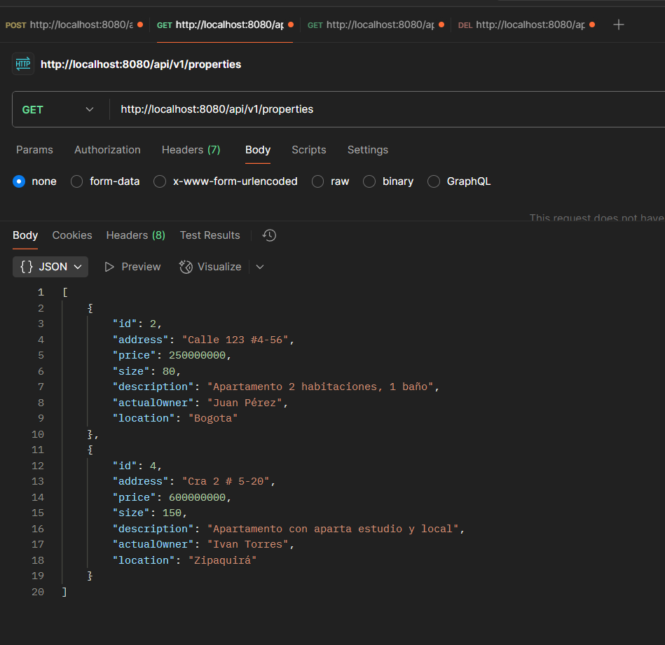
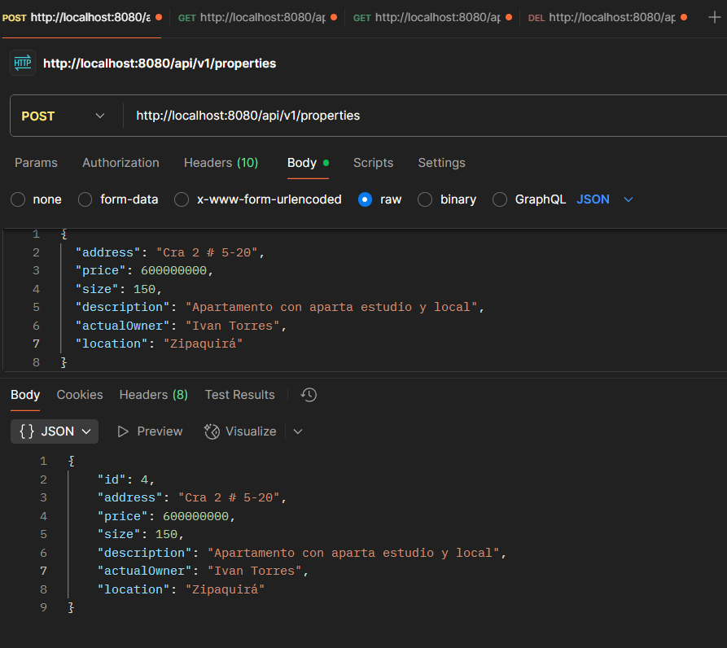
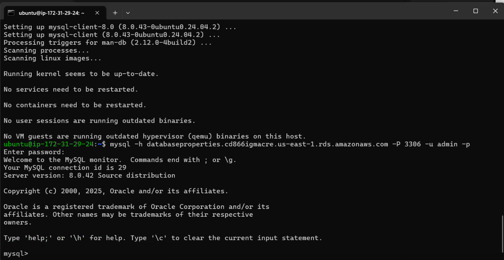

# Creacion del repositorio utilizando Spring Initializr:
- Definimos las caracteristicas:
    - Project: Maven.
    - Language: Java.
    - Spring Boot: 3.5.6
    - Project Metadata:
        - Group: com.properties.
        - Artefact: manage-properties.
        - Name: manage-properties.
        - Package name: com.properties.manage_properties.
    - Java: 21
    - Dependencies:
        - Spring Web:
        - Spring Data JPA:
        - Spring Boot DevTools:
        - Lombok:
        - Validation:
        - MySQL Driver:


# Arquitectura de nuestro Backend:

- **model (Clase):**
    - Acá definimos el "molde" de lo que vamos a utilizar en este caso son propiedades, allí implementamos las características (atributos), getters, setters y constructores.

- **repository (Interfaz):**
    - Capa que tiene comunicación con la base de datos utilizando JPA.
    - Acá se dan los CRUD básicos como save, findById, findAll, deleteById.
    - Podemos agregar métodos que consideremos que serán utiles en un futuro.

- **Service:**
    - Acá se definen las reglas de negocio.

- **Controller:**
    - recibe las órdenes del usuario y se encarga de solicitar los datos al modelo y de comunicárselos a la vista.
# Models:
## Property.java: Acá definimos el modelo de nuestras propiedades para nuestra API.

Acá vamos a encontrar nuestra clase base alli vamos a encontrar los atributos:

- id.
- address (String).
- price (Integer).
- size (Integer).
- dsescription (String).
- actualOwner (String).

Encontramos validaciones como:

- @NotBlank -> Aplica para Strings.
- @Size(max = 100)
- @Column(nullable = false , length = 100) -> nullable  para que no sea nulo y length para su longitud.
- @NotNull -> Aplica para números.
- @Positive -> Aplica para números.

Diferencia entre Size y length.
- Size es una regla, si la regla no se cumple el registro no se guarda, length es para el tamaño.

utilizamos el plugin de lombook para evitar realizar getters, setters y constructores, la notación de estos es la siguiente:

- @Getter 
- @Setter
- @NoArgsConstructor 
- @AllArgsConstructor 
- @Builder

# Repository:

- Colocamos funciones adicionales que se encuentran en nuestros requerimientos.

    - **List <Property> findByLocation (String location);**
        - Devuelve una lista de propiedades que se encuentran en una locación.
    - **List <Property> findPropertyBetwwenPrice (int minPrice, int maxPrice);**
        - Devuelve una lista de propiedades que se encuentran entre un precio minimo y un precio maximo.
    - **List <Property> findPropertyBetweenSize (Integer minSize, Integer maxSize);**
        - Devuelve una lista de propiedades que se encuentran entre un tamaño minimo y un tamaño maximo.

# Service:
- Primero declaramos como final la variable que representará a nuestro repositorio.

- tenemos los siguiente métodos:
    - **Property createProperty (Property property):** El cual crea una nueva propiedad y se invoca al repositorio con la función save.
    - **List <Property> findByLocation (String location):** Devuelve una lista de las propiedades que se encuentran en esa locación, invoca al repositorio con el método findByLocation.
    - **List <Property> findAll:** Devuelve una lista con todas las propiedades, invoca al repositorio con el método findAll.
    - **Property findById (Long id):** Devuelve una propiedad mediante el Id, invoca al repositorio mediante la función findById.
    - **void deleteById (Long id):** Elimina una propiedad mediante el id, invoca al repositorio mediante dos funciones la primera findById para validar la propiedad y la segunda deleteById.
    - **List <Property> findPropertyBetwwenPrice:** Devuelve una lista con las propiedades que se encuentran en un rango de precios, invoca al repositorio con la función findPropertyBetwwenPrice.
    - **Property updateProperty (Long id, Property property):** actualiza los campos de las propiedades, invoca el repositorio con la funcion findById para verificar la existencia, luego save para guardar los cambios.

# Controller
- Primero definimos la reuta general de nuestra Api con la notación @RequestMapping("api/v1/properties"), ahora vamos a definir los metodos en compañia de Post, Get, Put, Delete.

- Utilizamos las siguientes anotaciones:
    - **@Valid**: lo que hace es "Activar" las validaciones que definimos en el modelo como por ejemplo @NotNull, si en el body no estan los datos correctamente se lanza una excepción.
    - **@RequestBody:** Lo que hace es que toma el parámetro que el usuario coloca en la petición para convertirlo en un objeto Java.
    -**@PathVariable:** Lo que hace esta anotación es tomar el valor de la petición y pasarlo a la URL.

- Tenemos los siguientes métodos:

    - **@PostMapping**
        
        **ResponseEntity<?> create(@Valid @RequestBody Property request)**

        En este método lo que hacemos es crear nuestra propiedad a partir de los datos ingresados en la petición del usuario realizando una serie de validaciones.

    - **@GetMapping("/{id}")**
       
       **ResponseEntity<?> getById(@PathVariable Long id)**

       En este método lo que hacemos es buscar una propiedad a través de un Id digitado por el usurio.

    - **@GetMapping**

        **ResponseEntity<?> getAll()**
        
        Este método devuelve todas las propiedades.

    - **@PutMapping("/{id}")**

        **ResponseEntity<?> update(@PathVariable Long id, @Valid @RequestBody Property request)**

        Este método es uno de los más importantes lo que hace es realizar la actualización de valores de una propiedad, realiza la validación de datos, además de eso, utiliza el valor id introducido por el usuario.

    - **@DeleteMapping("/{id}")**

        **ResponseEntity<?> delete(@PathVariable Long id)**

        Este método elimina una de las propiedades identificadas por el ID.

    - **@GetMapping("/location/{location}")**

        **ResponseEntity<?> getByLocation(@PathVariable String location)**

        Una de las funciones propuestas como bono, lo que hace es que toma el valor de locación dada por el usuario y devuelve una lista con las propiedades en esa área.

    - **@GetMapping("/price-range/{minPrice}/{maxPrice}")**

        **ResponseEntity<?> getByPriceRange(@PathVariable int minPrice, @PathVariable int maxPrice)**

        Función propuesta como bono, lo que hace es devolver una lista con las propiedades que estan en un rango de un precio minimo y un precio máximo.

    - **@GetMapping("/size-range/{minSize}/{maxSize}")**

        **ResponseEntity<?> getBySizeRange(@PathVariable Integer minSize, @PathVariable Integer maxSize)**

        Función propuesta como bono, lo que hace es devolver una lista con las propiedades que estan en un rango de un tamaño minimo y un tamaño máximo.

# Correr MySQL de manera Local (Procedimiento):

- Lo que hacemos es traer la imagen de MySql desde un contenedor de Docker, utilizamos lo siguiente:


- Como Docker no tenia la imagen de MySql la trajo desde DockerHub.
- Traida la imagen se creo un contenedor para ser utilizado.
- El contenedor se levantó de manera correcta y se implemento en segundo plano.


# application.yml
- Archivo importante ubicado en la ruta:
    - src\main\resources\application.yml

 Acá configuramos la conexión a la base de datos de manera local tenemos datos como:
 - **Nombre:** properties_db
 - **Puerto:** 3306
 - **Usuario**
 - **Contraseña**


# Ejecución del Proyecto
Para ejecutar nuestro proyecto hacemos lo siguiente:

- En nuestro CMD escribimos: git clone https://github.com/Ttowers-09/ApiRest_Properties.git
- Luego de clonarclo escribimos cd ApiRest_properties
- Escribimos mvn clean package
- y por ultimo mvn spring-boot:run
    Allí empezará a correr nuestro código.

- Para terminar la ejecución: Ctrl + c

# Pruebas realizadas en postman
- **Buscar propiedad por Id:**


- **Buscar por locación:**


- **Obtener todas las propiedades:**


- **Crear una propiedad:**


- **Listar propiedades por rangos de precios:**
 

    

- **Listar propiedades por rango de tamaño:**


- **Eliminar propiedad por id:**


- **Actualizar una propiedad:**


# Proceso para dezplegar con AWS

1- Creamos nuestra instancia en una maquina UBUNTU, la Instancia EC2 se llamará "Database_Instance"


2- Luego creamos y descargamos las llaves de seguridad (Importante saber donde se guardan porque más adelante se van a necesitar), además de eso escogemos un grupo de seguridad, para este ejercicio cree uno llamado Security_Group_Databasa_Arep

3- Configuramos nuestro almacenamiento.

4- Lanzamos nuestra instancia y esperamos que esta se cree.


5- En nuestro grupo de seguridad Security_Group_Databasa_Arep, cambiamos las reglas de entrada, alli permitimo el trafico de MYSQL/AURORA por el puerto 3306, permitimos el trafico SSH por el puerto 22 y permitimos el trafico TCP por el puerto 8080.

6- Verificamos las reglas de entradas.

7- Nos dirigmos nuevamente a nuestra instancia, en la parte superior veremos el boton donde dice "Conectar", alli nos ditrigimos a la ventana "Cliente SSH" y copiaremos el link que dice Ejemplo:

8- Nos dirigimos a nuestra máquina local en la carpeta donde tenemos nuestras llave previamente, alli copiaremos el link anteriormente copiado.

9- Esperamos que cargue.

10- Actualizamos los paquetes de nuestra máquina de Ubuntu

11- Esperamos a que termine de procesar.

12- Instalamos MySQL en UBUNTU

13- Esperamos a que termine de procesar.

14- Establecemos la conexión a nuestra base de datos, mediante el puerto 3306 y el user que es admin previamente definido.

15- Introducimos la contraseña creada en la instancia y verificamos que continue con normalidad.

16- Dentro de mySql creamos la base de datos para este caso lo llamaremos "propertiesDataBase"

17- Verificamos.

18- En nuestro entorno local actualizaremos nuestro documento application.properties, alli se mantiene la conexión a la base de datos y nuestras credenciales.

19- En nuestra base de datos verificamos la creación de las tablas.

20- Ejecutamos nuestro proyecto en localHost en el browser, alli hacemos un ejemplo de uso, y luego verificamos en la consola y verificamos que si se halla registrado.

Luego de comprobar la conexión lo vamos a montar en nuestra instancia EC2
21- Actualizamos nuevamente los paquetes de nuestra maquina.

22-Esperamos que cargue.

23-Procedemos a descargar todo el paquete de Jaca, maven y JDK21

24-Permitimos el trafico SSH por el puerto 22, por el puerto 8080, luego activamos el firewall y aplicamos las reglas ya hechas.

25-Creamos la ruta /opt/app/env el -p sirve para crear toda la rura en caso que no exista, Luego creamos el archivo backend.env con las variables de entorno y por ultimo solo permisos de lectura.

26-Otorgamos la propiedad a Ubunto para no estar utilizando el sudo, accedemos a la carpeta y alli clonamos nuestro repositorio.

27- Accedemos a la carpeta de nuestro repositorio y alli ejecutamos el proyecto sin ejecutar los Test con el fin de generar el .jar

28-Esperamos a que cargue


29- Luego de estar compilado, entramos a la carpeta target, listamos los elementos y alli vizualizaremos el tar, luego lo ejecutamos.

30-Empezara a cargar.

31- Accedemos a nuestro browser con la IP publica de nuestra instancia.


# Estructura de nuestro proyecto:
```
C:.
├───.mvn
│   └───wrapper
├───src
│   ├───main
│   │   ├───java
│   │   │   └───com
│   │   │       └───properties
│   │   │           └───manage_properties
│   │   │               ├───controller
│   │   │               ├───model
│   │   │               ├───repository
│   │   │               └───service
│   │   └───resources
│   │       ├───aws
│   │       ├───readmeImg
│   │       ├───static
│   │       └───templates
│   └───test
│       └───java
│           └───com
│               └───properties
│                   └───manage_properties
└───target
    ├───classes
    │   ├───aws
    │   ├───com
    │   │   └───properties
    │   │       └───manage_properties
    │   │           ├───controller
    │   │           ├───model
    │   │           ├───repository
    │   │           └───service
    │   ├───readmeImg
    │   └───static
    ├───generated-sources
    │   └───annotations
    ├───generated-test-sources
    │   └───test-annotations
    ├───maven-archiver
    ├───maven-status
    │   └───maven-compiler-plugin
    │       ├───compile
    │       │   └───default-compile
    │       └───testCompile
    │           └───default-testCompile
    └───test-classes
        └───com
            └───properties
                └───manage_properties
```

# Video:

https://1drv.ms/f/c/a0a575a235eb8a36/Et4ceMAdkSNGrB0kqkh1umABRhLPZ-yCWjsvsgfXQ7S8hQ?e=qQcbCf